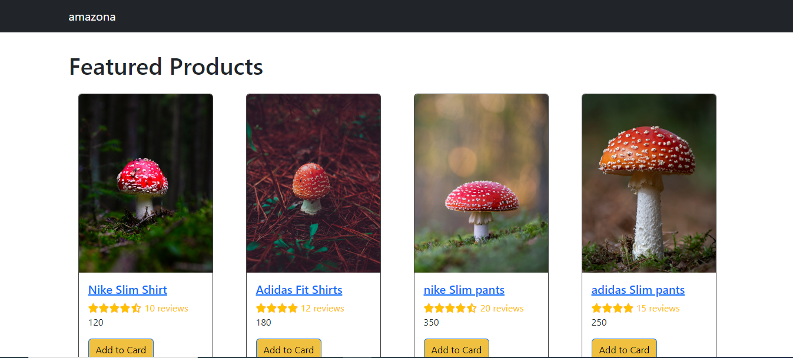
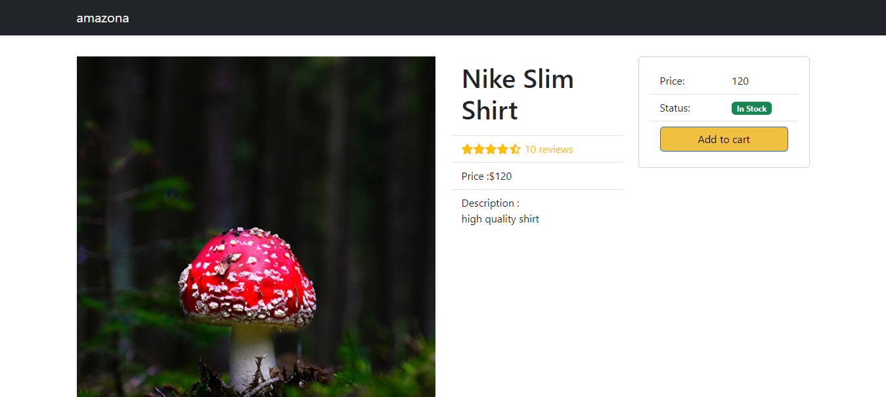

# Amazona

Amazona is not amazon but a dummy ecommerce application which just shows some mushrooms with the weird naming coming from the backend 🍄. I have made this project in the very early stages of my learning.

## Objectives

- Learning React fundamentals and backend communication.
- Creating a small server.

## Getting Started

**Open in VSCode:**
Open the project in VSCode.

**Run Server:**
Run the server by going in the directory 'backend' and run the following commands.

- npm start

**Run Client:**
Run the client by going in the directory 'frontend' and run the following commands.

- npm install
- npm start

**User Interactions:**

- See all the products on homepage.
- See a single product with the details.
